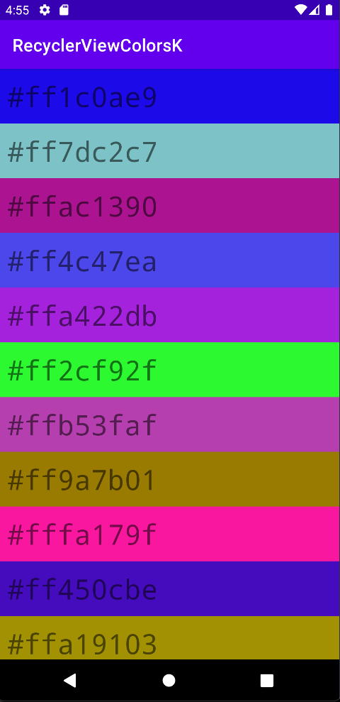
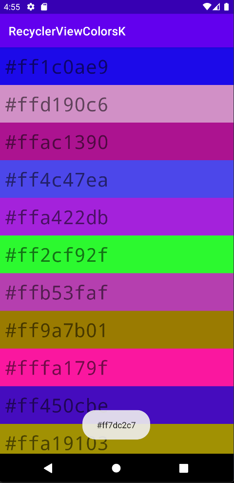

# Начало работы с RecyclerView

RecyclerView отличается рядом особенностей делегирует свою работу отдельным классам

- Layout Manager
- Item Decorator
- Item Animator
- Adapter
- View Holder

Необходимо доработать приложение, добавить в него палитру цветов в colors.xml или реализовать генерацию по палитре.

[Проект-заготовка](https://github.com/ipetrushin/RecyclerViewColorsK)

[Создание списков с помощью Recycler View](https://youtu.be/eOI0C8V3kzg)

## Демонстрация работы

|  |  |
| ------------------- | ------------------- |

